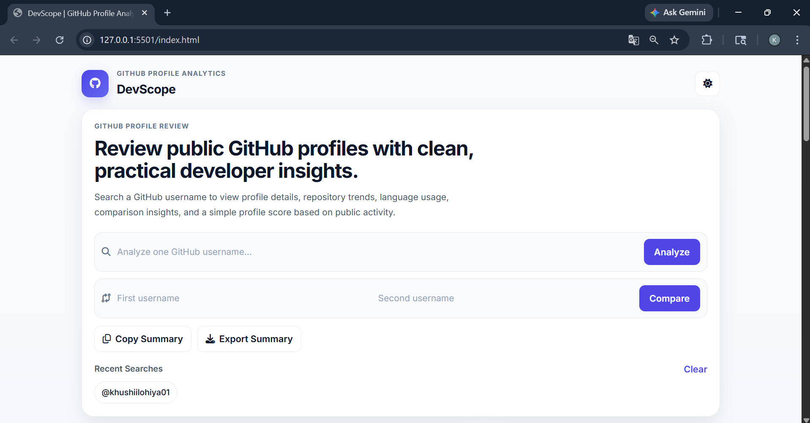
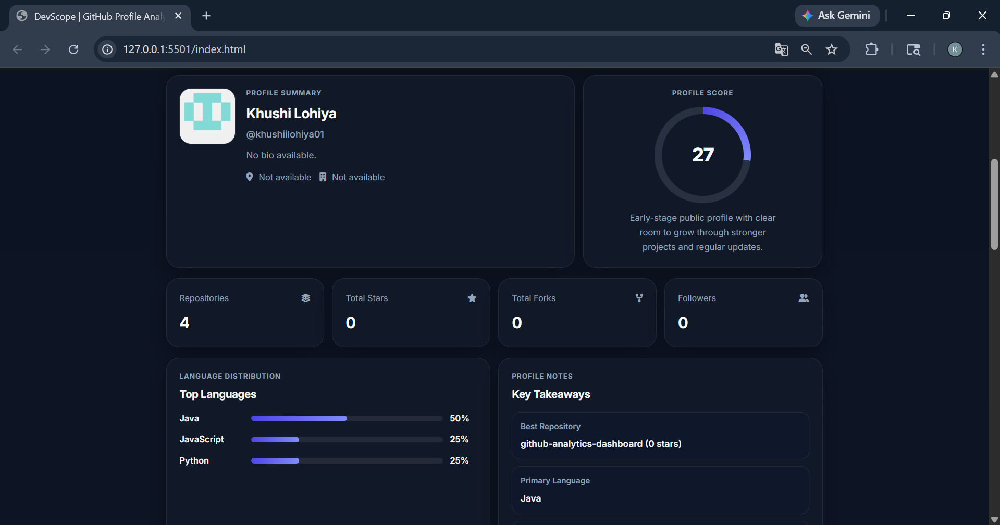
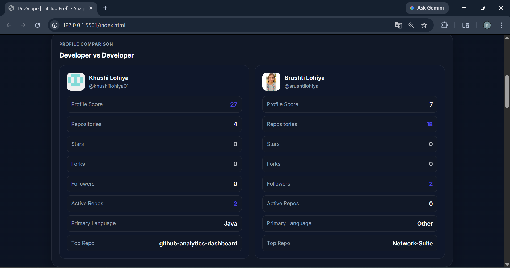
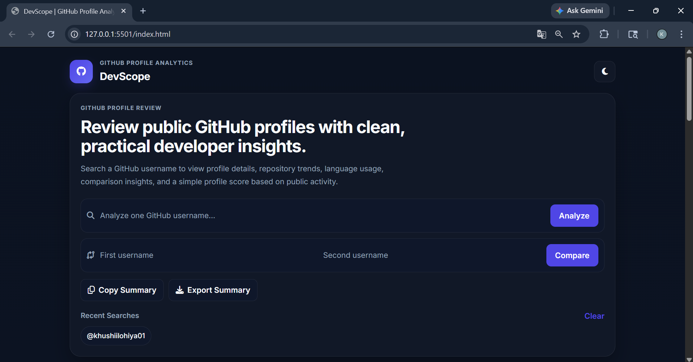

## DevScope 
GitHub Profile Analytics Dashboard

DevScope is a clean and responsive web application for reviewing public GitHub profiles. It highlights key profile details, repository statistics, language usage, contribution graph display, comparison insights, and an overall profile score based on public activity and visibility.

---

## Features

- Search any public GitHub profile
- View profile insights such as repositories, stars, forks, and followers
- Profile score based on activity, visibility, and repository quality
- Contribution graph display for the searched profile
- Language distribution visualization
- Repository analysis with sorting and filtering
- Recent activity detection based on repository updates
- Best repository recommendation
- Practical improvement suggestions
- Compare two GitHub profiles side by side
- Copy generated summary to clipboard
- Export profile summary as a text file
- Light / Dark mode toggle
- Recent searches stored in local storage
- Fully responsive layout

---

## Tech Stack

- HTML5
- CSS3
- Vanilla JavaScript
- GitHub REST API
- External contribution chart image service

---

## How to Run Locally

1. Clone the repository  
git clone 
2. Open the folder
3. Run the project
open index.html

or simply double click the file.

---

## What This Project Does

DevScope helps review public GitHub profiles in a more structured way. Instead of only showing raw GitHub data, it organizes profile information into a cleaner dashboard with:
- profile summary
- score breakdown
- repository insights
- comparison view
- contribution graph display
- practical suggestions for improvement

This makes it useful for portfolio review, internship preparation, and general developer profile analysis

---

## Use Cases
- Evaluate GitHub profiles for internships
- Analyze developer activity and contribution trends
- Compare developers side-by-side
- Improve personal portfolio presentation

---

## Limitations
- Works only with public GitHub profiles
- GitHub API rate limits may apply (unauthenticated requests)
- No backend (pure frontend project)
- Contribution graph is displayed using an external chart source, not generated from a custom backend

---

## Future Improvements
- More detailed contribution analytics
- GitHub OAuth support
- PDF export
- Improved profile scoring logic
- Better visual comparison insights

---

## Preview
Home Dashboard

Analayzed Profile

Compare Profiles

Dark Mode View
